# Registry application

- Registry is a web application with primitive UI to support virtual file system.  
- Supports HTTP GET, PUT, and DELETE, used by maven, to browse and manipulate the data.  
- Implements Nuget and NPM REST API.  
- Access to the application is authorized.


- Registry stores data in IBM Cloud Object Storage instance accessed by dedicated Service ID not exposed to the end user.  
- Users are granted access rights by the owner who manages them in IAM API Keys dashboard of another dedicated Service ID.    
- Access rights are granted for read or write and are subject of directory filtering.

# User

Users may configure maven, nuget, npm or other tools to use application as a private registry.

## Steps to configure maven.

### 1. Configure `settings.xml`
Define repositories and credentials in the `settings.xml` file, which is typically located in the `${MAVEN_HOME}/conf` directory or the `${USER_HOME}/.m2` directory.

#### Adding Repositories
Add repositories in the `profiles` section of the `settings.xml` file. Here’s an example:

```xml
<settings>
  <servers>
    <server>
      <id>my-private-repo</id>
      <username>your-username</username>
      <password>your-password</password>
    </server>
  </servers>

  <profiles>
    <profile>
      <id>private-repo-profile</id>
      <repositories>
        <repository>
          <id>my-private-repo</id>
          <url>https://your-private-repo-url/repository/</url>
        </repository>
      </repositories>
    </profile>
  </profiles>

  <activeProfiles>
    <activeProfile>private-repo-profile</activeProfile>
  </activeProfiles>
</settings>
```

Replace `my-private-repo`, `your-username`, `your-password`, and `https://your-private-repo-url/repository/` with your repository ID, credentials, and URL.

### 2. Deploying Artifacts
To deploy artifacts use the `deploy:deploy-file` goal to specify the repository URL and credentials directly in the command line or in a profile.

Here’s an example of how to deploy an artifact using the `deploy:deploy-file` goal:

```sh
mvn deploy:deploy-file -DgroupId=com.example -DartifactId=my-artifact -Dversion=1.0.0
  -Dpackaging=jar -Dfile=path-to-your-artifact.jar
  -DrepositoryId=my-private-repo
  -Durl=https://your-private-repo-url/repository/maven-releases/
```

### 3. Using the Private Repository in Other Projects
To use the private repository in other projects ensure that the `settings.xml` file on the machines where these projects are built includes the profile with the repository configuration.

## Steps to configure Nuget

### 1. Add the Private NuGet Source
Use the `dotnet nuget add source` command to add your private NuGet source. Replace `source-name`, `https://your-private-repo-url/nuget/v3/index.json`, `your-username`, and `your-password` with your repository name, URL, and credentials.

```sh
dotnet nuget add source --name source-name
  --username your-username
  --password your-password
  --store-password-in-clear-text https://your-private-repo-url/nuget/v3/index.json
```

# Owner

## Steps to create and manage registry application.

### TL;DR
Following are lengthy steps in IBM Cloud site to configure new registry application. If you are not a fan of boring instructions, then look at the [bash script](cloud-setup.sh) that will do all the work for you.

### Long way

1. Create or select existing IBM [Cloud Object Storage](https://cloud.ibm.com/objectstorage) instance (referred later as `CLOUD_OBJECT_STORAGE`).

- Cloud Object Storage  
  

- Create Instance  
    

- Storage Configuration   
  

2. Create a new bucket in "Cloud Object Storage"/"Instances"/`CLOUD_OBJECT_STORAGE` (referred later as APP_BUCKET).

- Create bucket  
  

- Use simple bucket configuration  
  

- Select bucket parameters  
  

- Mutable without versioning  
  

- Don't expose it as a static site  
  

- If after creation you're lost then go to Resource list and  
  

- select storage  
  

3. Create new [Service ID](https://cloud.ibm.com/iam/serviceids) (referred later as `APP_USER`) that should be used to access Cloud Object Storage and IAM Identity service to to validate users.
Take note of `ID` of `APP_USER` clicking "Details".

- Service ID  
  

- Create Service ID  
  

4. Click API Keys of `APP_USER` Service ID, and create Access Key. Note its name and access key.

- Service ID API Keys  
  
  
- Create API Key  
  

- API Key created  
  
   
5. Assign write access for `APP_USER` to `CLOUD_OBJECT_STORAGE`.

- Click "Assign Access" in Access tab of Service ID `APP_USER`  
  
  
- Follow "Assign access" wizard and select `CLOUD_OBJECT_STORAGE` service  
  
  
- All Resources, and "Writer" role  
  
  
- Verify, Add, and then assign the access.  
  
  
6. Assign IAM Identity keys inspection to then `API_USER`.

- Click "Assign Access" in Access tab of Service ID `APP_USER`  
  
  
- Follow "Assign access" wizard and select `IAM Identity Service` service, All Resources, and "Operator" role or a custom role containing action `iam-identity.apikey.get`. Verify, Add, and then assign the access.  
  

7. Create another [Service ID](https://cloud.ibm.com/iam/serviceids) (referred later as `USERS_CONTAINER`) that will be used to create access keys with grants to access application.

- Create Service ID  
  
  
8. Create a [Code Engine project](https://cloud.ibm.com/codeengine/projects) (referred later as `MY_REGISTRY`). During project creation make sure you selected correct project location and a resource group. In general it should be the same as for `CLOUD_OBJECT_STORAGE`.

- Cloud Engine Projects  
  

- Create project  
  

- Click Create and then follow project link to go to project page  
  
  
9. Go to the "Project settings"/"Integrations"

- to configure service bindings and connect it to a resource group and then to configure "Container Ragistry" - this is place where application images are stored  
  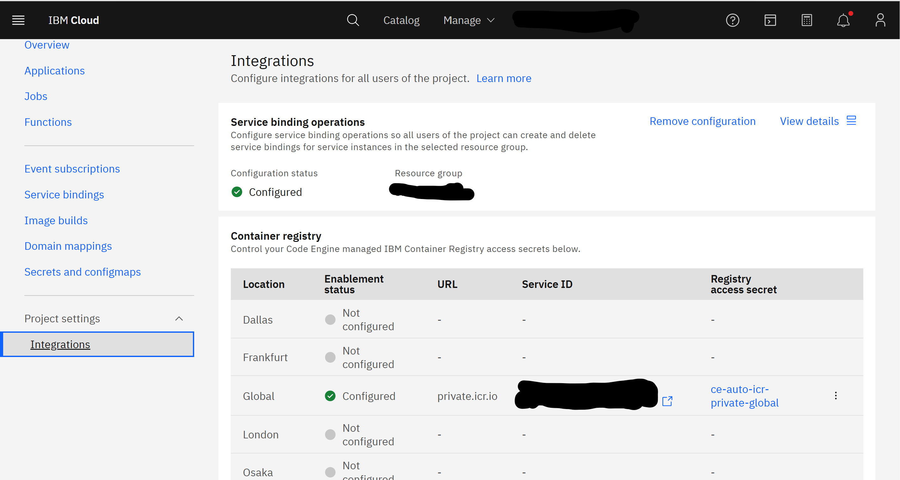

10. Inside `MY_REGISTRY` project create new "service binding" to Cloud Object Storage using Access Key for `APP_USER`. 
- Service binding  
  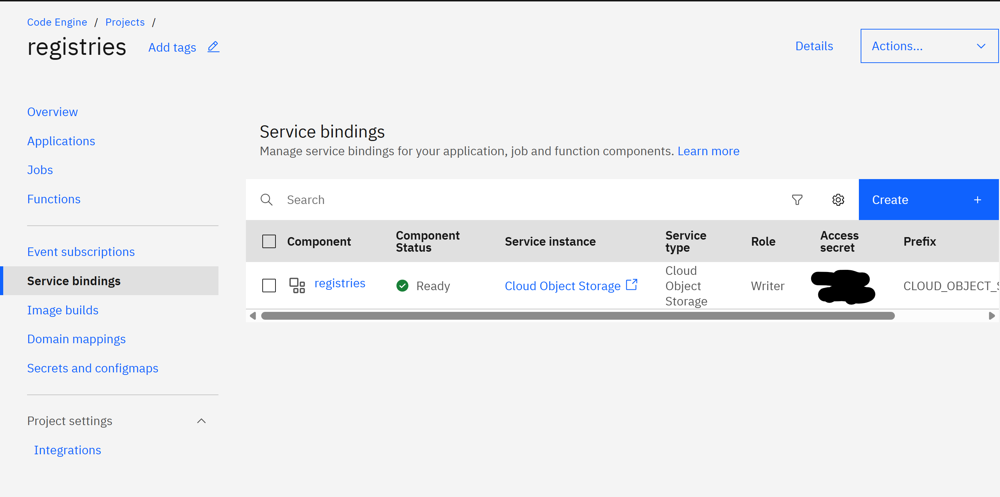

- Select service  
  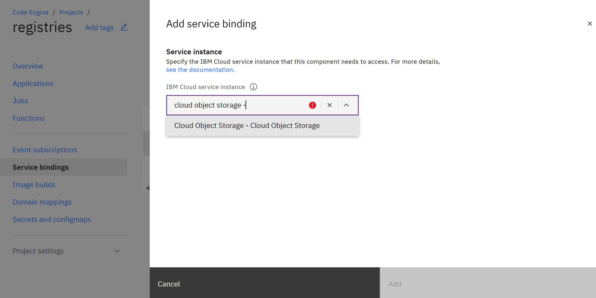
  
- Make sure service binding prefix is an empty value. During service binding select `APP_USER` as service credential, and verify that the role is `Writer`.  
  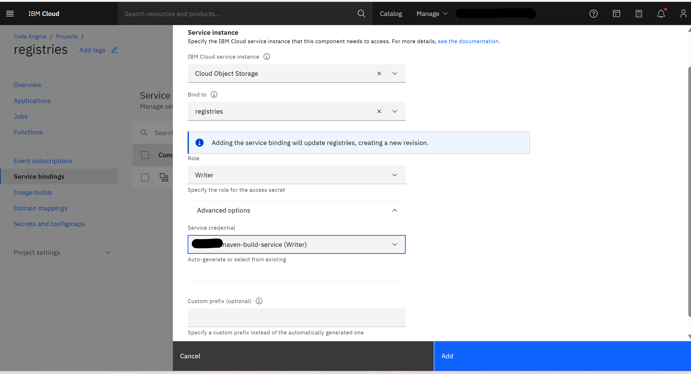
  
11. Create an application within project 

- Select "Applications" and click "Create"  


- Configure image to build from source, and click "Specify build details"  
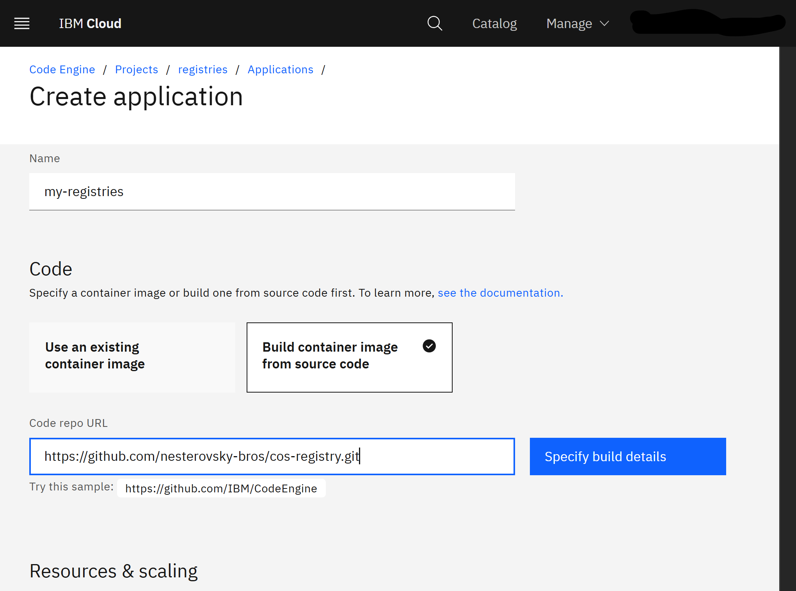

- where you put repository details  


- select "Cloud Native Buildpack" build strategy  


- Select a registry server (e.g. private.icr.io), select or create registry secret (e.g. "Code Engine managed secret"), select namespace and define image name  


- In Resources & scaling section set "Scale-down delay" to non zero value (e.g. 120 seconds).  
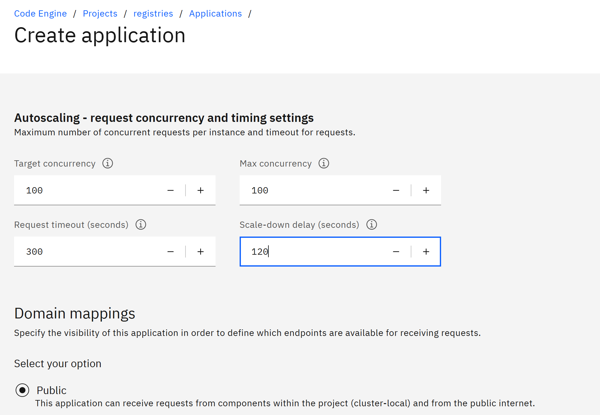

In environment variable section add following variables:   
  - `APP_BUCKET` - with the bucket name.  
  - `APP_USER_SERVICE_ID` - with the `USERS_CONTAINER`.  


Create the instance  
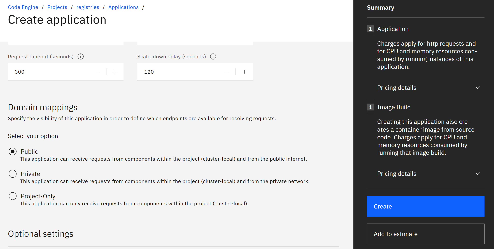

12. Build and deploy application image.

- In "Image builds" of application you can see existing build runs  
  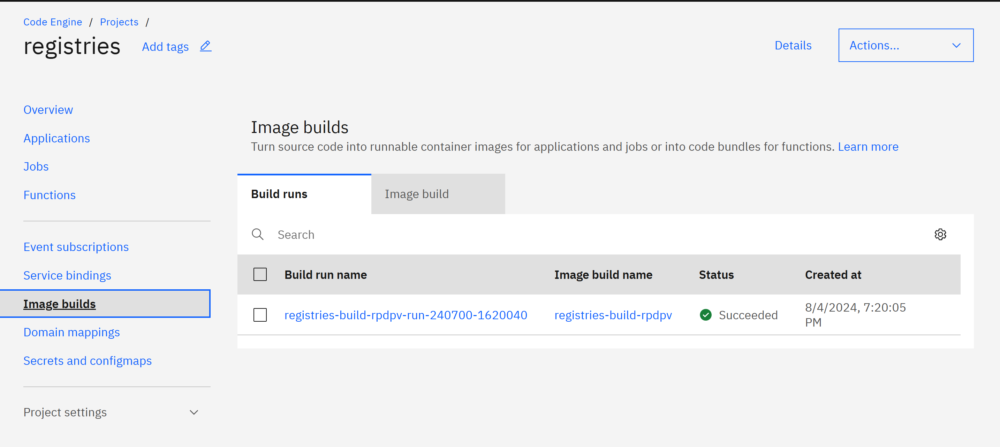

- or create a new build  
  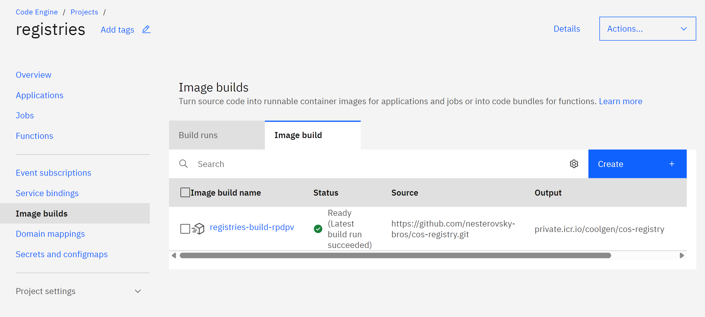

- go into the application (notice "**Open URL**" link), and  
  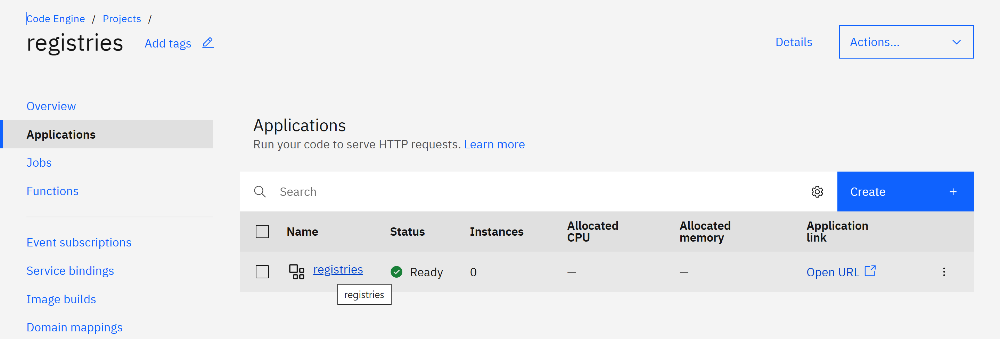

- then into configuration and click "Redeploy"  
  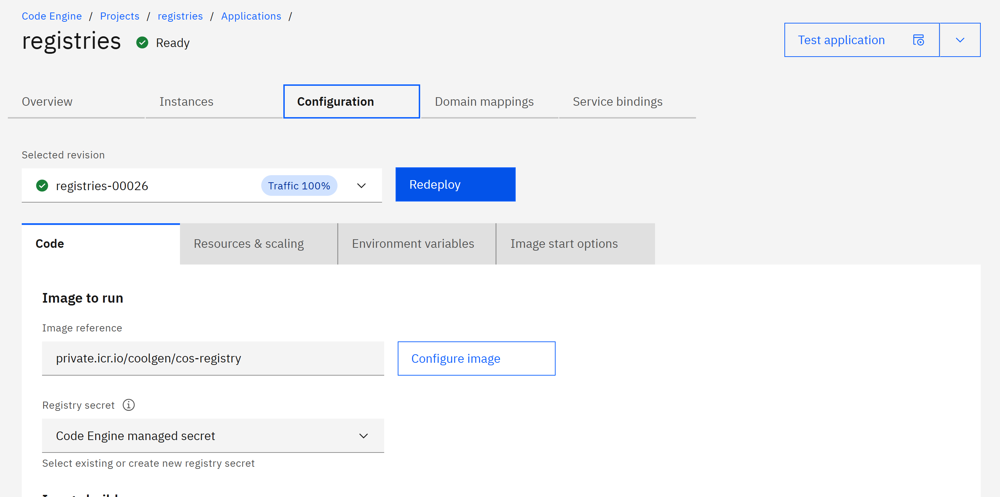
  
  After this step application is up and running, so you can open application URL.
13. Final, administrative, step is to manage users.

- Go to Access (IAM)  
  

- into API Keys of [Service ID](https://cloud.ibm.com/iam/serviceids) `USERS_CONTAINER`  
  
  
- Create API Key for a user.  
  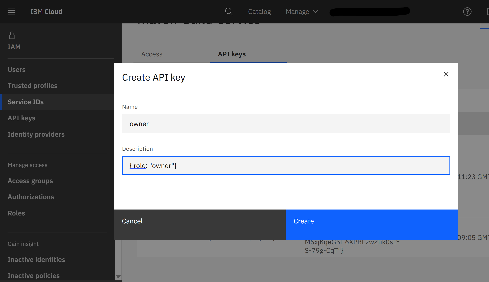

- Give API key secret should be given to the users.


- Use Description to configure access rights. It should contain JSON in format:

```JSON
{
  "role": "reader or writer or owner", 
  "include": ["glob"],
  "exclude": ["glob"]
}
```

- If "role" is not specified then "reader" is assumed.
- If "include" is not specified then access is permitted to a whole tree; otherwise only to a subtree matched to some include glob.
- If "exlude" is not specified then access is not additionally restricted; otherwise it's restricted to subtrees matched to any exclude glob.
- Other properties are permitted, e.g. `"accesskey": "secret"` to memorize API Key secret.  


Last step should be repeated for all users.
That's all!
