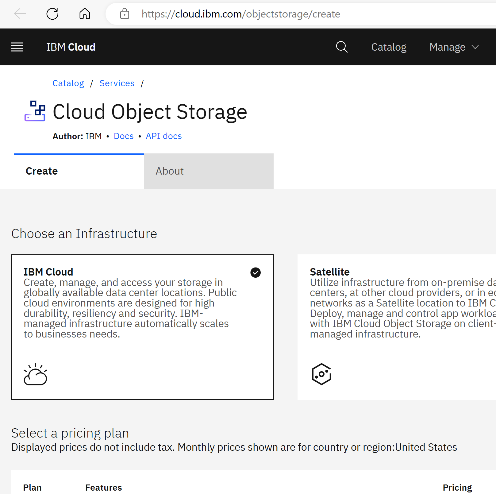
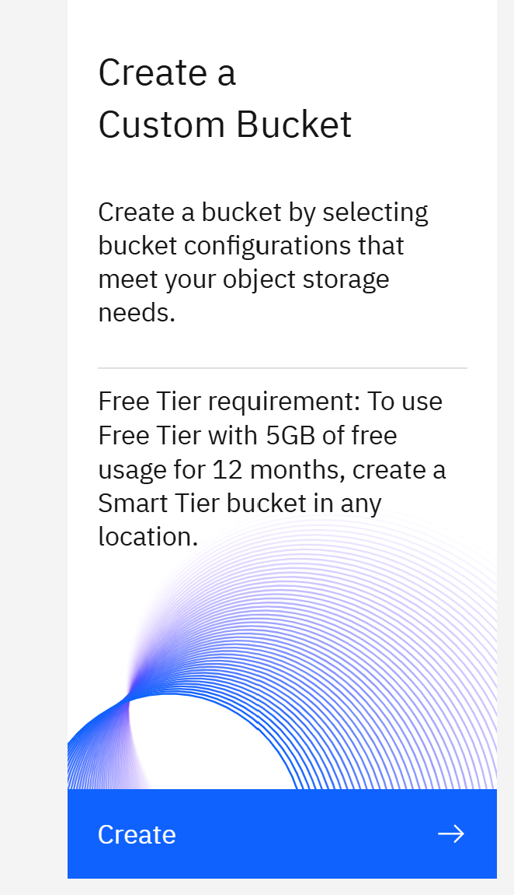
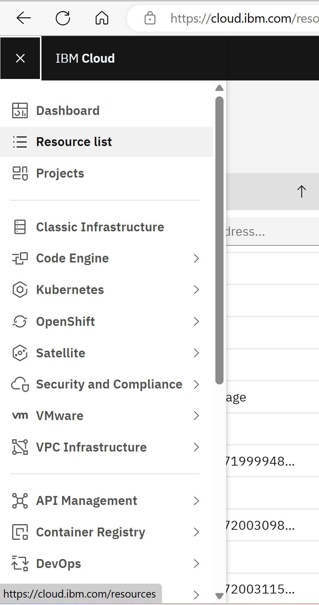
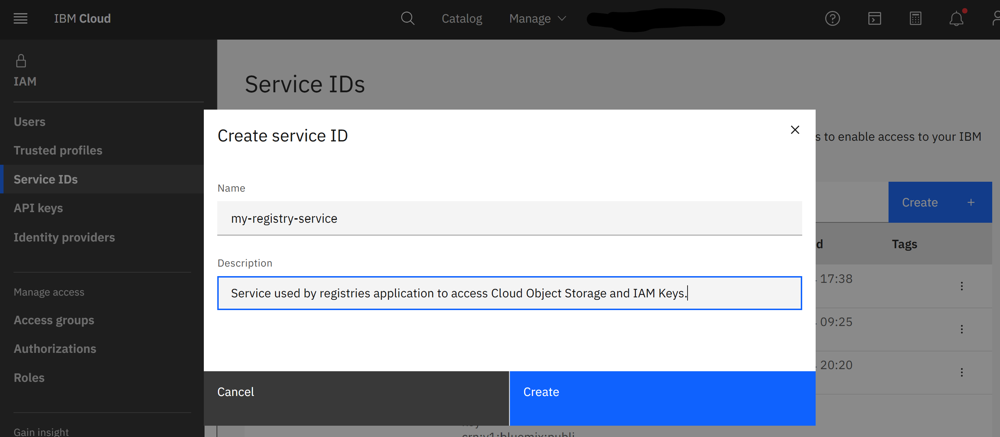
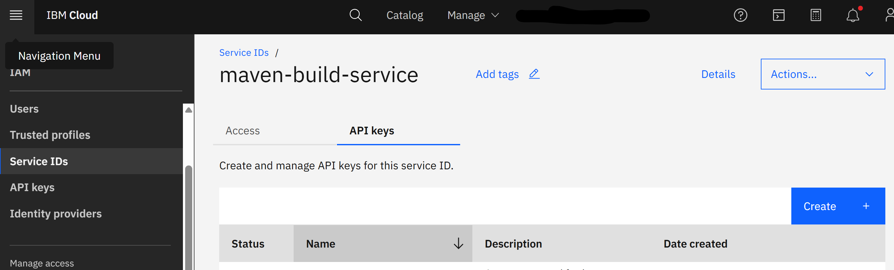
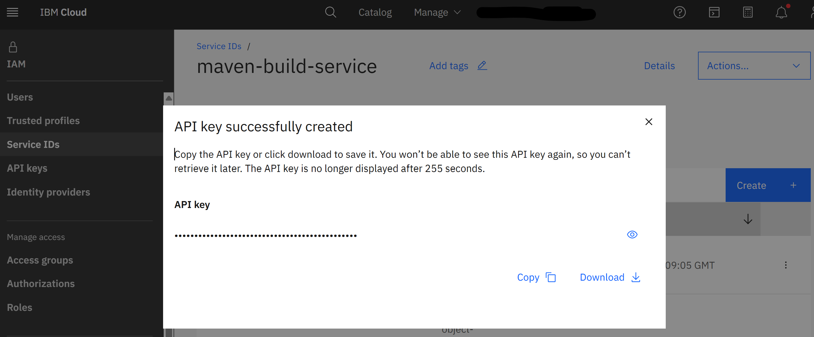
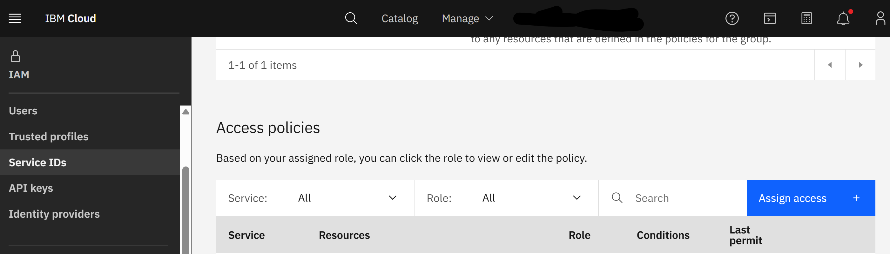
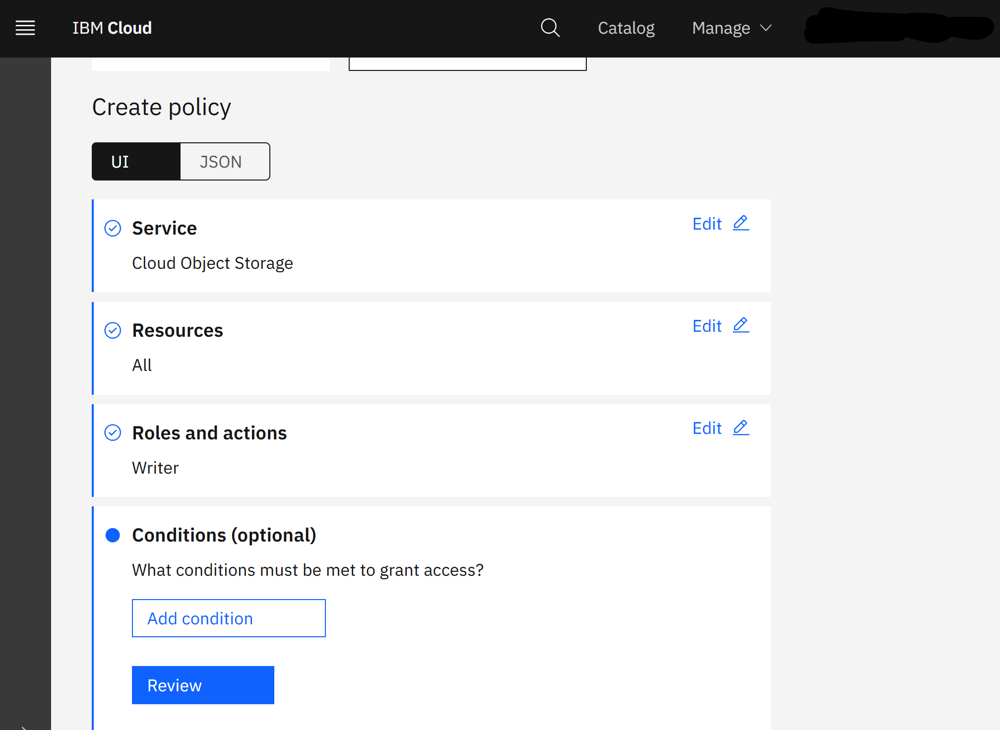
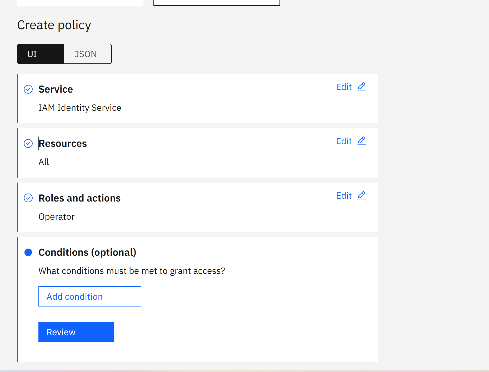
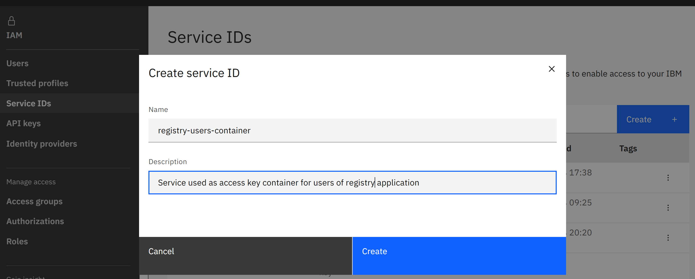

# Registry application

- Registry is a web application with primitive UI to support virtual file system.  
- Supports HTTP GET, PUT, and DELETE, used by maven, to browse and manipulate the data.  
- Implements Nuget and NPM REST API.  
- Access to the application is authorized.


- Registry stores data in IBM Cloud Object Storage instance accessed by dedicated Service ID not exposed to the end user.  
- Users are granted access rights by the owner who manages them in IAM API Keys dashboard of another dedicated Service ID.    
- Access rights are granted for read or write and are subject of directory filtering.

# TODO: Explain following in details.

# User

Given a url and an access token users configure https endpoints in maven, nuget, npm or in other tool.

# Owner

## Steps to create and manage registry application.

1. Create or select existing IBM [Cloud Object Storage](https://cloud.ibm.com/objectstorage) instance (referred later as `CLOUD_OBJECT_STORAGE`).

- Cloud Object Storage  
  

- Create Instance  
    

- Storage Configuration   
  

2. Create a new bucket in "Cloud Object Storage"/"Instances"/`CLOUD_OBJECT_STORAGE` (referred later as APP_BUCKET).

- Create bucket  
  

- Use simple bucket configuration  
  

- Select bucket parameters  
  

- Mutable without versioning  
  

- Don't expose it as a static site  
  

- If after creation you're lost then go to Resource list and  
  

- select storage  
  

3. Create new [Service ID](https://cloud.ibm.com/iam/serviceids) (referred later as `APP_USER`) that should be used to access Cloud Object Storage and IAM Identity service to to validate users.
Take note of `ID` of `APP_USER` clicking "Details".

- Service ID  
  

- Create Service ID  
  

4. Click API Keys of `APP_USER` Service ID, and create Access Key. Note its name and access key.

- Service ID API Keys  
  
  
- Create API Key  
  

- API Key created  
  
   
5. Assign write access for `APP_USER` to `CLOUD_OBJECT_STORAGE`.

- Click "Assign Access" in Access tab of Service ID `APP_USER`  
  
  
- Follow "Assign access" wizard and select `CLOUD_OBJECT_STORAGE` service  
  
  
- All Resources, and "Writer" role  
  
  
- Verify, Add, and then assign the access.  
  
  
6. Assign IAM Identity keys inspection to then `API_USER`.

- Click "Assign Access" in Access tab of Service ID `APP_USER`  
  
  
- Follow "Assign access" wizard and select `IAM Identity Service` service, All Resources, and "Operator" role or a custom role containing action `iam-identity.apikey.get`. Verify, Add, and then assign the access.  
  

7. Create another [Service ID](https://cloud.ibm.com/iam/serviceids) (referred later as `USERS_CONTAINER`) that will be used to create access keys with grants to access application.

- Create Service ID  
  
  
8. Create a [Code Engine project](https://cloud.ibm.com/codeengine/projects) (referred later as `MY_REGISTRY`). During project creation make sure you selected correct project location and a resource group. In general it should be the same as for `CLOUD_OBJECT_STORAGE`.
9. Go to the "Project settings"/"Integrations" to configure service bindings and connect it to a resource group; and then to configure "Container Ragistry" - this is place where application images are stored.
10. Inside `MY_REGISTRY` project create new "service binding" to Cloud Object Storage using Access Key for `APP_USER`. Make sure service binding prefix is an empty value.
During service binding select `APP_USER` as service credential, and verify that the role is `Writer`.
11. Create an application within project - select "Applications" and click "Create". 
Configure image to build from source, and click "Specify build details", where you put repository details, select "Cloud Native Buildpack" build strategy, select a registry server (e.g. private.icr.io), select or create registry secret (e.g. "Code Engine managed secret"), select namespace and define image name. In Resources & scaling section set "Scale-down delay" to non zero value (e.g. 60 seconds). In environment variable section add following variables:
  - `APP_BUCKET` - with the bucket name.
  - `APP_USER_SERVICE_ID` - with the `USERS_CONTAINER`.
12. Build and deploy application image.
  After this step application is up and running.
13. Last step is to create API Keys within [Service ID](https://cloud.ibm.com/iam/serviceids) `USERS_CONTAINER` to grant access to users. 
Give API key secret should be given to the users.

While creating API Key for a new user use description to configure access rights.
It should contain JSON in format:

```JSON
{
  "role": "reader or writer or owner", 
  "include": ["glob"],
  "exclude": ["glob"]
}
```

- If "role" is not specified then "reader" is assumed.
- If "include" is not specified then access is permitted to a whole tree; otherwise only to a subtree matched to some include glob.
- If "exlude" is not specified then access is not additionally restricted; otherwise it's restricted to subtrees matched to any exclude glob.
- Other properties are permitted, e.g. `"accesskey": "secreet"` to memorize API Key secret.

# Developer

There are more environment variable to play with.
